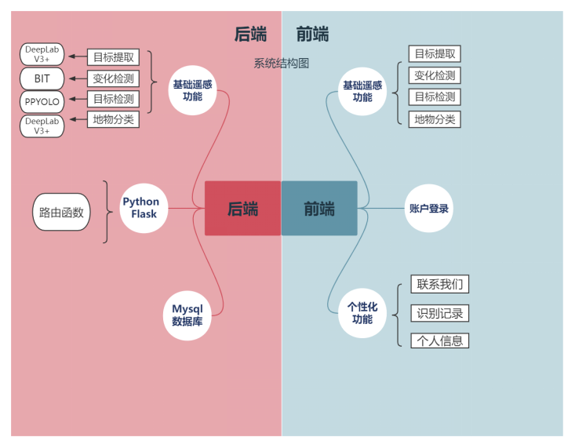

# SES-CCUT

## 比赛介绍
***
“中国软件杯”大学生软件设计大赛是一项面向中国在校学生的公益性赛事，是2021年全国普通高校大学生竞赛榜单内竞赛。大赛由国家工业和信息化部、教育部、江苏省人民政府共同主办，致力于正确引导我国在校学生积极参加软件科研活动，切实增强自我创新能力和实际动手能力，为我国软件和信息技术服务业培养出更多高端、优秀的人才。

[比赛官网链接](http://www.cnsoftbei.com/plus/view.php?aid=706)

### 赛题背景

掌握国土资源利用和土地覆盖类型，是地理国情普查与监测的重要内容。高效获取准确、客观的土地利用情况，监测国土变化情况，可以为国家和地方提供地理国情信息决策支撑。随着遥感、传感器技术的发展，特别是多时相高分辨率遥感图像数据的普及，使我们可以足不出户，就能掌握全球任一地表的细微变化。

目前，我国遥感领域已步入了高分辨率影像的快车道，对遥感数据的分析应用服务的需求也与日俱增。传统方式对高分辨率卫星遥感图像的对特征刻画能力差且依赖人工经验工作量巨大。随着人工智能技术的兴起，特别是基于深度学习的图像识别方法获得了极大的发展，相关技术也推动了遥感领域的变革。相对于传统基于人海战术的目视解译方法，基于深度学习的遥感图像识别技术可以自动分析图像中的地物类型，在准确率和效率方面展现出极大的潜力。

### 功能要求
在这套系统中，选手需要实现目标提取、变化检测、目标检测和地物分类四大分析功能，官方将提供每个功能实现所需的训练数据集。
- 目标提取（使用图像分割技术对卫星图像中指定对象完成分割）
- 变化检测（使用图像分割技术对同区域两个时期的卫星图像变化情况完成分析）
- 目标检测（使用目标检测技术对卫星图像中指定对象完成检测）
- 地物分类（使用图像分割技术对卫星图像每个像素完成分类）
- 软件运行在WEB平台

## 项目介绍
***
### 系统架构
根据比赛要求，系统整体结构由前端基础遥感功能，个性化账户功能两部分组成，后端基于BIT算法、DeepLabV3+算法和PPYoLo算法实现四大基本功能，形成一个架构完整，结构体系清晰的遥感智能解译平台。

### 算法设计
遥感图像解译平台实现了变化检测、目标检测、目标提取和地物分类四个基本功能。
在变化检测实现过程中，我们选择了百度飞浆提供的BIT网络据
在目标检测实现过程中，我们选择了百度飞浆提供的PPYoLo网络
在目标提取、地物分类功能实现中，我们团队选择了百度飞浆开源的DeepLabV3+网络